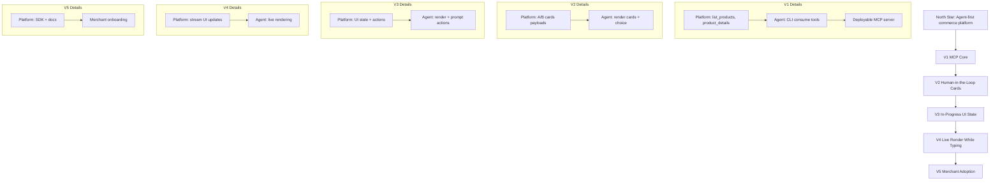

# Slopyfy Project Plan

This document is the evolving plan for an AI‑agent‑first commerce platform, with iterative milestones and a shared vocabulary across platform and agent workstreams.

## North Star
A commerce platform that exposes agent‑friendly APIs and UI primitives so AI agents can browse, compare, and execute actions with humans in the loop, and eventually render interactive components natively in the agent environment.

## Scope and Assumptions
- Early iterations prioritize MCP tool exposure and minimal agent consumption.
- UI rendering evolves from static cards to interactive components and live updates.
- Initial vertical: clothing shop with a small curated catalog.

## Iterations

### V1 — MCP Core
Platform (Adilet)
- Expose MCP tools: `list_products`, `product_details`.
- Provide reference catalog with realistic attributes.
- Support stdio + Streamable HTTP transport.

Agent (Eugene)
- Minimal CLI agent to call MCP tools and display results.

Deliverable
- Remote‑deployable MCP server + local agent.

### V2 — Human‑in‑the‑Loop Cards
Platform
- Return UI payloads for product choices (A vs B cards).
- Attach optional metadata for agent/UI rendering.

Agent
- Render basic cards.
- Accept user choice in chat and send selection back to platform.

Deliverable
- A/B choice flow end‑to‑end with card payloads.

### V3 — In‑Progress UI State
Platform
- Expose UI state object for ongoing sessions.
- Add actions endpoint for unstructured prompts that modify state.

Agent
- Render “in‑progress” UI state.
- Map unstructured prompts to actions and send updates.

Deliverable
- Agent can show evolving UI and handle free‑text actions.

### V4 — Live Render While Typing
Platform
- Stream partial UI updates for progressive rendering.

Agent
- Render live updates as the user types.

Deliverable
- Real‑time UI updates with partial content.

### V5 — Merchant Adoption
Platform
- SDK + docs + templates for merchants.
- Minimal integration steps and validation tooling.

Deliverable
- Merchant onboarding path with reference integration.

## Visual Graph (Mermaid)

## Open Questions
- Card payload format: AG‑UI protocol adherence vs. custom lightweight schema.
- Authentication and session identity for remote MCP.
- Agent rendering target: CLI only vs. dedicated UI surface.
- Persistence: products, carts, sessions.
- Deployment target for hosted MCP.
